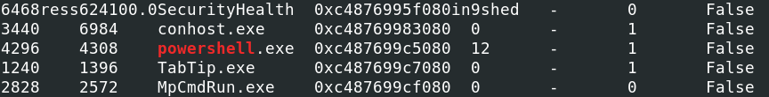
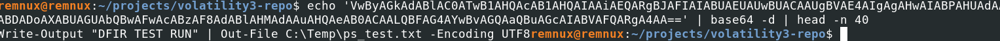

# Windows Memory Forensics: Volatility 3

**Goal.** I analysed `memdump.dmp` to find and decode PowerShell `-EncodedCommand` activity.

**Key skills.** Memory forensics, process hunting with Volatility, payload extraction and safe offline decoding.

---

## Environment & context
Analysis performed on REMnux using Volatility 3. Target image: `memdump.dmp`.

---

## Quick reproduction

```bash
python3 vol.py -f memdump.dmp windows.psscan
python3 vol.py -f memdump.dmp windows.pstree
strings -el memdump.dmp | grep -i EncodedCommand
```

---

## What I found

- `psscan` recovered a terminated `powershell.exe` (PID 4296).  
- `strings` showed repeated `-EncodedCommand` invocations containing a base64 blob.  
- I extracted and decoded the blob offline (UTF-16LE → UTF-8). The decoded payload created `ps_test.txt` and used `Start-Sleep -Seconds 600`.

**Decoded payload (trimmed example):**
```powershell
New-Item -Path C:\temp\ps_test.txt -ItemType File -Force
Start-Sleep -Seconds 600
# (payload trimmed)
```

---

## Results

- Recovered terminated PowerShell process (PID 4296) and evidence of encoded command execution.  
- Extracted and decoded the payload into `/artefacts/decoded_payload.txt`.  
- Observed a long sleep in the payload (behaviour consistent with sandbox-evasion techniques).

---

**Key evidence - Decoded payload**



---

## Artefacts

`/artefacts/decoded_payload.txt`

---

## MITRE ATT&CK mapping

| Tactic          | Technique                                    | Evidence / Notes |
|-----------------|-----------------------------------------------|------------------|
| Execution       | T1059.001 - PowerShell                        | Encoded PowerShell observed in process command-line |
| Defence Evasion | T1027 - Obfuscated / Encoded Commands         | Base64 payload recovered from memory |
| Defence Evasion | T1497.001 - Virtualization / Sandbox Evasion  | `Start-Sleep -Seconds 600` observed - behaviour consistent with delayed-execution sandbox evasion |
| Discovery       | T1057 - Process Discovery                     | Hidden/terminated PowerShell recovered with `psscan` |

---

Full walkthrough and expanded outputs: `/docs/volatility-case-study.md`  
Screenshots: `/screenshots/`  
Raw artefacts: `/artefacts/`
